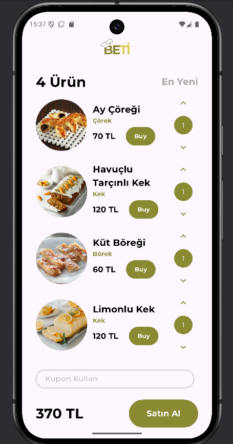
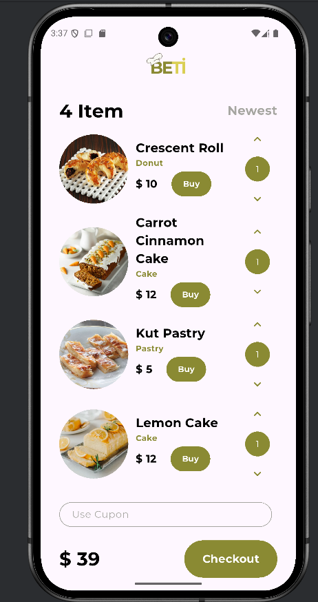

# Flutter Yemek Uygulaması

Bu proje, Flutter kullanarak geliştirilmiş bir yemek siparişi uygulaması tasarımıdır. Proje, tasarım becerilerini geliştirmek ve Flutter'ın çeşitli özelliklerini öğrenmek amacıyla yapılmıştır. Şu anda butonlar ve diğer fonksiyonel özellikler aktif değildir, sadece kullanıcı arayüzü tasarımı tamamlanmıştır.

## Öğrenilen Konular

### Font ve Görsel Ekleme (Assets)

Projede kendi fontlarımı ve görsellerimi kullanmayı öğrendim. `pubspec.yaml` dosyasında assets klasörünü tanımlayarak görsellere ve fontlara erişim sağladım:

```yaml
assets:
  - images/
  
fonts:
  - family: Montserrat
    fonts:
      - asset: fonts/Montserrat-Regular.ttf
      - asset: fonts/Montserrat-Bold.ttf
        weight: 700
```

Görselleri uygulamada şu şekilde kullanıyorum:

```dart
Image.asset(
  "images/$yemekResimDosyaUzantisi",
  width: ekranGenisligi/3.7,
  height: ekranGenisligi/3.7,
  fit: BoxFit.cover,
)
```

Ve fontları şu şekilde:

```dart
TextStyle(
  fontFamily: "Montserrat",
  fontWeight: FontWeight.bold,
  fontSize: 20,
  color: yaziRenk1,
)
```

### Row, Column ve Stack Yapıları

Flutter'da düzenleme için temel yapılar olan Row ve Column'u etkin bir şekilde kullanmayı öğrendim:

- **Row**: Yatay düzenlemeler için
  ```dart
  Row(
    mainAxisAlignment: MainAxisAlignment.spaceBetween,
    children: [
      Text("4 ${d!.urun}", style: TextStyle(...)),
      Text(d.enYeni, style: TextStyle(...)),
    ],
  )
  ```

- **Column**: Dikey düzenlemeler için
  ```dart
  Column(
    mainAxisAlignment: MainAxisAlignment.spaceEvenly,
    children: [
      // İçerik elemanları
    ],
  )
  ```

### İçerik Hizalama İşlemleri

Flutter'da içerik hizalama işlemlerini öğrendim:

#### MainAxisAlignment
Ana eksen boyunca içerikleri nasıl hizalayacağımı öğrendim:
- `MainAxisAlignment.spaceBetween`: İçerikler arasında eşit boşluk bırakarak başlangıç ve sona yerleştirir
- `MainAxisAlignment.spaceEvenly`: İçerikler ve kenarlar arasında eşit boşluk bırakır
- `MainAxisAlignment.center`: İçerikleri merkeze hizalar

```dart
Row(
  mainAxisAlignment: MainAxisAlignment.spaceBetween,
  children: [
    Text(d.fiyatToplam, style: TextStyle(...)),
    SizedBox(
      width: 150,
      height: 60,
      child: TextButton(...),
    ),
  ],
)
```

#### CrossAxisAlignment
Çapraz eksende (ana eksene dik) içeriklerin nasıl hizalanacağını öğrendim:
- `CrossAxisAlignment.start`: İçerikleri başlangıca hizalar
- `CrossAxisAlignment.center`: İçerikleri merkeze hizalar
- `CrossAxisAlignment.end`: İçerikleri sona hizalar

```dart
Column(
  crossAxisAlignment: CrossAxisAlignment.start,
  children: [
    Text(yemekAdi, style: TextStyle(...)),
    // Diğer içerik elemanları
  ],
)
```

#### MainAxisSize
Ana eksenin boyutunu kontrol etmeyi öğrendim:
- `MainAxisSize.min`: İçerik kadar alan kaplar
- `MainAxisSize.max`: Mümkün olan maksimum alanı kaplar

### Özelleştirilmiş Widget (KartChip)

Tekrar kullanılabilir bileşenler oluşturmayı öğrendim. KartChip adında kendi widget'ımı geliştirdim:

```dart
class KartChip extends StatelessWidget{
  final String yemekResimDosyaUzantisi;
  final String yemekAdi;
  final String yemekTuru;
  final String yemekFiyat;
  final double ekranGenisligi;
  final double ekranYuksekligi;

  KartChip({required this.yemekResimDosyaUzantisi, required this.yemekAdi,required this.yemekTuru,required this.yemekFiyat, required this.ekranGenisligi, required this.ekranYuksekligi});

  @override
  Widget build(BuildContext context) {
    // Widget içeriği
  }
}
```

Bu widget sayesinde kod tekrarını önleyerek daha temiz ve bakımı kolay bir kod yapısı oluşturdum.

### Çoklu Dil Desteği

Flutter'da çoklu dil desteği eklemeyi öğrendim:

1. `pubspec.yaml` dosyasında gerekli paketleri ekledim:
```yaml
dependencies:
  flutter_localizations:
    sdk: flutter
  intl: ^0.18.0
```

2. `l10n.yaml` dosyası oluşturdum:
```yaml
arb-dir: lib/l10n
template-arb-file: app_en.arb
output-localization-file: app_localizations.dart
```

3. Dil dosyalarını `lib/l10n/` klasörüne ekledim:
   - `app_en.arb` (İngilizce)
   - `app_tr.arb` (Türkçe)

4. Uygulamada kullanım:
```dart
var d = AppLocalizations.of(context);
Text(d!.urun, style: TextStyle(...))
```

5. `main.dart` dosyasında tanımladım:
```dart
MaterialApp(
  localizationsDelegates: const[
    AppLocalizations.delegate,
    GlobalMaterialLocalizations.delegate,
    GlobalWidgetsLocalizations.delegate,
    GlobalCupertinoLocalizations.delegate,
  ],
  supportedLocales: const [
    Locale('en', ''),
    Locale('tr', ''),
  ],
  // ...
)
```

### Çoklu Ekran Desteği

Farklı ekran boyutlarına uyum sağlayan bir uygulama geliştirmeyi öğrendim:

```dart
var ekranBilgisi = MediaQuery.of(context);
final double ekranYuksekligi = ekranBilgisi.size.height;
final double ekranGenisligi = ekranBilgisi.size.width;
```

### Ekrana Göre Orantılı Tasarım

Uygulamanın farklı cihazlarda tutarlı görünmesi için tasarım elemanlarını ekran boyutuna göre orantıladım:

```dart
// Genişliği ekran genişliğine göre ayarlama
width: ekranGenisligi/3.7,

// Boşlukları ekran genişliğine göre ayarlama
SizedBox(width: ekranGenisligi/18,),

// Padding değerlerini ekrana göre ayarlama
padding: EdgeInsets.only(left: ekranGenisligi/34.25),
```

### TextField Özelleştirme

TextField widget'ını özelleştirmeyi öğrendim:

```dart
TextField(
  textAlign: TextAlign.start,
  decoration: InputDecoration(
    hintText: d.kuponKullan,
    contentPadding: EdgeInsets.symmetric(vertical: 10, horizontal: 20),
    hintStyle: TextStyle(color: yaziRenk2, fontFamily: "Montserrat"),
    enabledBorder: OutlineInputBorder(
      borderRadius: BorderRadius.circular(25),
      borderSide: BorderSide(color: yaziRenk2),
    ),
  )
)
```

### Responsive Tasarım

Responsive (duyarlı) tasarım ilkelerini uygulayarak, uygulamanın farklı ekran boyutlarında düzgün çalışmasını sağladım.

## Ekran Görüntüleri




## Kurulum

1. Flutter SDK'yı yükleyin
2. Projeyi klonlayın
3. Gerekli paketleri yüklemek için terminalde şu komutu çalıştırın:
   ```
   flutter pub get
   ```
4. Uygulamayı çalıştırmak için:
   ```
   flutter run
   ```

## Gelecek Geliştirmeler

- Buton fonksiyonlarının aktifleştirilmesi
- Backend entegrasyonu ile gerçek sipariş işlemleri
- Kullanıcı hesabı ve giriş sistemi
- Ödeme altyapısı entegrasyonu
- Sepet ve sipariş geçmişi ekranları
- Arama ve kategorilendirme özellikleri

## Not

Bu proje, Flutter öğrenme sürecimde oluşturduğum bir çalışmadır. Şu anda butonlar ve diğer fonksiyonel özellikler aktif değildir, sadece kullanıcı arayüzü tasarımı tamamlanmıştır.
